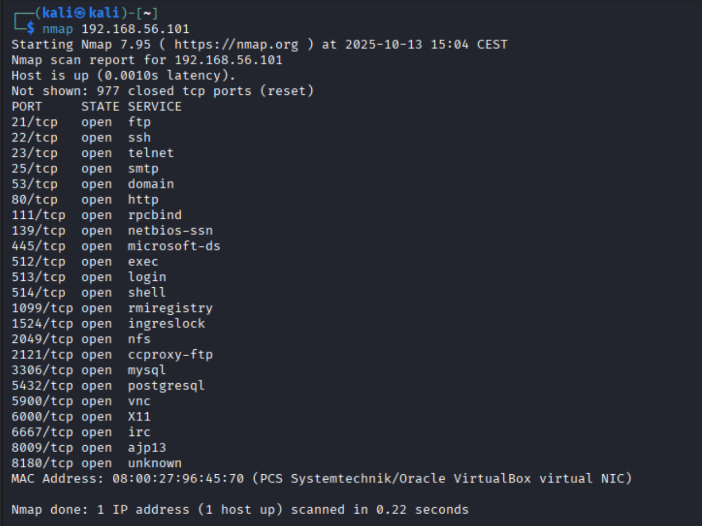

# Hacking

### Pentesting baten faseak&#x20;

\

Pentesting prozesuak bost fase nagusi ditu:

#### 1. Informazio bilketa (fase pasiboa)

Erasotzaile batek lehenik eta behin enpresari buruzko informazio publikoa bilduko luke: domeinuak, IP publikoak, sarearen egitura edo erabiltzen dituzten teknologia orokorrak. Fase honetan ez da sistemetan zuzenean jarduten.

Adibidea: WHOIS kontsultak, DNS erregistroak, sare sozialetan agertzen den informazioa.

#### 2. Zerbitzuen eta sistemen identifikazioa

Helburua sareko IP aktiboak eta hauek eskaintzen dituzten zerbitzuak ezagutzea da. Horretarako eskaneatze tresnak erabiliko lirateke, hala nola Nmap.

Adibidea: 192.168.10.15 IPan Apache zerbitzua eta 192.168.10.10 IPan Mysql detektatu dira.

#### 3. Ahulezien bilaketa

Sistemetan dauden akats edo konfigurazio okerrak identifikatzen dira. Horretarako, bertsio zaharrak, adabaki gabeak edo lehenetsitako konfigurazioak aztertzen dira.

Adibidea: Web zerbitzarian PHP 7.2 bertsio zaharra eta segurtasun actualizazio gabea.

#### 4. Ustiapena (explotacion)

Ahuleziak nola aprobetxatu daitezkeen aztertzen da, beti ingurune kontrolatuan. Helburua da sistemaren egoera ulertzea, ez kaltea egitea.

Adibidea: SQL Injection baten bidez datu konfidentzialak lortzeko aukera aztertzea edo posible den.

#### 5. Dokumentazioa eta gomendioak

Azkenik, aurkitutako arazoak eta arriskuak dokumentatzen dira, eta neurri zuzentzaileak proposatzen dira: eguneraketak, konfigurazio aldaketak, prestakuntza, eta abar…

Adibidea: PHP bertsioaren eguneraketa, firewall arauak kompontzea…

\
\
\

Adibidea empresako sarean:

### 1. Informazio bilketa (fase pasiboa)

Pentester-ak enpresari buruzko informazio publikoa biltzen du, sistemak zuzenean ukitu gabe.

Adibideak:

* whois burdinola.lan Domenioaren erregistro informazioa lortzen da.\
  \

* nslookup burdinola.lan  DNS erregistroak (MX, A, TXT…).\
  \

* Enpresaren LinkedIn profila aztertzea  IT saileko kideen izenak eta erabilitako teknologia batzuk ager daitezke (adib. “Debian + Apache”).\
  \

* Shodan-en bilaketa: IP publikoari lotutako zerbitzuak ikus daitezke.\
  \

### &#x20;2. Zerbitzuen eta sistemen identifikazioa

Helburua sarean aktibo dauden makinak eta haien zerbitzuak identifikatzea da.

Adibides:

nmap -sS -p- 85.45.23.120

Ataka irekiak: 22 (SSH), 80 (HTTP), 443 (HTTPS).

Barne-sareko eskaneoa:

nmap -sV 192.168.10.0/24

* 192.168.10.15: Apache 2.4.29 (Ubuntu)\
  \

* 192.168.10.10: MySQL 5.7.33\
  \

* 192.168.10.30: Samba 4.9.5\
  \

\

### &#x20;3. Ahulezien bilaketa

Orain zerbitzu horien bertsioetan edo konfigurazioan dauden akatsak aztertzen dira.

Adibideak:

* Apache 2.4.29 bertsioak CVE-2019-0211 ahulezia ezaguna du.\
  \

* MySQL 5.7.33 bertsio zaharra da, eguneraketarik gabe.\
  \

* Samba zerbitzarian sarbide anonimoa posible da.\
  \

Tresnak: OpenVAS, Nessus, edo searchsploit.

\

### &#x20;4. Ustiapena (Explotazioa)

Helburua da ahuleziak nola aprobetxa daitezkeen erakustea (baimenarekin beti).

Adibideak:

* Apache zerbitzarian exploit bat erabiliz sistemaren shell bat lortzen da.\
  \

* MySQL zerbitzariaren pasahitza lehenetsia aurkitzen da (root:root).\
  \

* Samba baliabide partekatu batean dokumentu konfidentzialak ikus daitezke.\
  \

\

### &#x20;5. Dokumentazioa eta gomendioak

Amaieran, aurkitutako arazo guztiak txosten batean jasotzen dira eta segurtasun-neurriak proposatzen dira.

Adibideak:

* Apache eta PHP eguneratu bertsio seguruetara.\
  \

* MySQL kontuetarako pasahitz sendoak ezarri.\
  \

* Samba zerbitzarian sarbide anonimoa desgaitu.\
  \

* Firewall konfiguratu kanpoko ataka ez-beharrezkoak ixteko.\
  \

* Langileei segurtasun prestakuntza eskaini.

\
\

#### Ekipo kritikoak

\

Lehenik, web zerbitzaria (192.168.10.15)da, kanpotik sarbidea duelako eta bezeroen datuak prozesatzen dituelako.

Bestetik datu-base zerbitzaria (192.168.10.10)da bertan gordetzen baitira informazio konfidentziala eta aplikazioen datu guztiak.

Posta zerbitzaria (192.168.10.20)da, komunikazio korporatiboak kudeatzen dituelako eta pasahitz edo fitxategi sentikorrak igarotzen direlako bertatik.\
Azkenik, fitxategi zerbitzaria (192.168.10.30)da, barneko dokumentazio eta proiektu fitxategiak partekatzeko erabiltzen delako.

\

#### Sareko beste elementuak

Pentestak ez ditu soilik ekipo kritikoak hartu kontuan, baita sareko beste osagai batzuk ere kontuan hartzen ditu.\
Horien artean dago router nagusia (192.168.10.254), sarearen irteera eta sarrera kudeatzen dituena, eta firewall kanpoko trafikoa filtratzeko erabiltzen dena.

Switch korporatiboaren konfigurazioa ere aztertu da, VLAN edo sare segmentazio egokia dagoen egiaztatzeko.\
Horrez gain, langileen ordenagailuak (192.168.10.50-150) aztertu dira, batez ere eguneraketak eta antibirusaren egoera konprobatzeko.

Azkenik, sarean aurkitu dira inprimagailu (192.168.10.15), non kasu batzuetan pasahitz lehenetsiak edo segurtasun-konfigurazio eskasak detektatu diren.

\

#### Ahuleziak eta eraso motak

Azterketan zehar sareko zenbait ekipo eta zerbitzutan ahuleziak identifikatu dira. Jarraian, ekipo bakoitzaren egoera, posible diren eraso motak, eragina eta gomendatutako neurriak laburbiltzen dira.

Mysaql zerbitzuan, Mysql 9.6 bertsio zaharra aurkitu da. Bertsio honek segurtasun-akats ezagunak ditu eta datu-ihesa edo pribilegio-eskalada bezalako erasoak eragin ditzake. Eragina handia da, eta gomendatutako neurria da sistema eguneratzea eta sarbidea erabiltzaile fidagarrietara mugatzea.

Bulego ekipoan, SMB eta LDAP konfigurazio irekia detektatu da. Horrek aukera ematen du kredentzialen lapurretarako edo sare barruko mugimendu latelakak. Neurri gomendatuak dira MFA (autentifikazio bikoitza) ipintzea.

Wordpress sisteman, PHP bertsio zaharra eta formulario ez segurua aurkitu dira, eta horrek SQL Injection motako erasoak ahalbidetu ditzake. Beharrezkoa da input sanitizazioa ezartzea eta WAF (Web Application Firewall) bat konfiguratzea.

Azkenik, firewall gailuan firmware zaharra aurkitu da, eta horrek sarrera baimenik gabea edo konfigurazio akatsak ekarrri ditzake. Eragina handia da, eta gomendatzen da firmware eguneratzea eta sistemaren logak aldizka aztertzea.

\
\

**teknika pasiboak**

Teknika pasiboek helburua dute sistemarekin zuzenean elkarreragin gabe informazioa lortzea,&#x20;

3 Adibide:

* DNS eta WHOIS kontsultak, enpresaren domeinuari eta IP publikoei buruzko informazioa lortzeko.\
  \

* Sare publikoko informazioaren bilketa, hala nola Shodan edo sare sozialetan agertzen den teknologia eta azpiegitura-informazioa.\
  \

* Metadatuen azterketa, dokumentu publikoetan (PDF, Word, irudiak...) ager daitezkeen erabiltzaile-izenak edo barneko ibilbideak aztertuz.\
  \

Teknika hauek erabilita, enpresaren sarearen egitura orokorra eta erabiltzen diren teknologia nagusiak ezagutzea lortuko litzateke, inolako sistemarik ukitu gabe.

\
\

Teknika aktiboak

Teknika aktiboak, berriz, helburu-sistemekin zuzenean elkarreragiten duten ekintzak dira. Hauek sistemaren portaera edo konfigurazioa aztertzeko erabiltzen dira.&#x20;

* Portu-eskaneoa, sareko IP nagusi batean zer portu ireki dauden identifikatzeko.\
  \

* Zerbitzuen identifikazioa, zerbitzu bakoitzaren bertsioa eta teknologia zehazteko.\
  \

* Zerbitzuen bertsioak eta ahuleziak dokumentatzea, aurkikuntza guztiak txostenean jasoz.\
  \

\

**Ebidentziak eta dokumentazioa**

Dokumentuan zerbitzuen taula eta aurkikuntzak ageri dira, jasotako informazio teorikoaren adierazi.\
Erabili diren tresnak (Nmap, WHOIS, DNS Lookup, banner grabbing...) eta jarraitu diren pausoak argi azaldu dira, eta prozesu osoa behar bezala dokumentatua geratu da.

\
\

NMAP

1\.

| nmap 192.168.56.101 | Scan a single IP |
| ------------------- | ---------------- |

\
\

\
\
\
\
\
\
\
\
\

2\.

| -p | nmap 192.168.56.101 -p 21 | Port scan for port x |
| -- | ------------------------- | -------------------- |

.png>)

\
\

3\.

| -sV | nmap 192.168.56.101 -sV | Attempts to determine the version of the service running on port |
| --- | ----------------------- | ---------------------------------------------------------------- |

.png>)

\

4\.

| O | 
nmap

 192.168.56.101 -O
 | [Remote OS detection](https://www.stationx.net/nmap-os-detection/) using TCP/IP stack fingerprinting |
| - | ------------------------------------ | ---------------------------------------------------------------------------------------------------- |

.png>)

\
