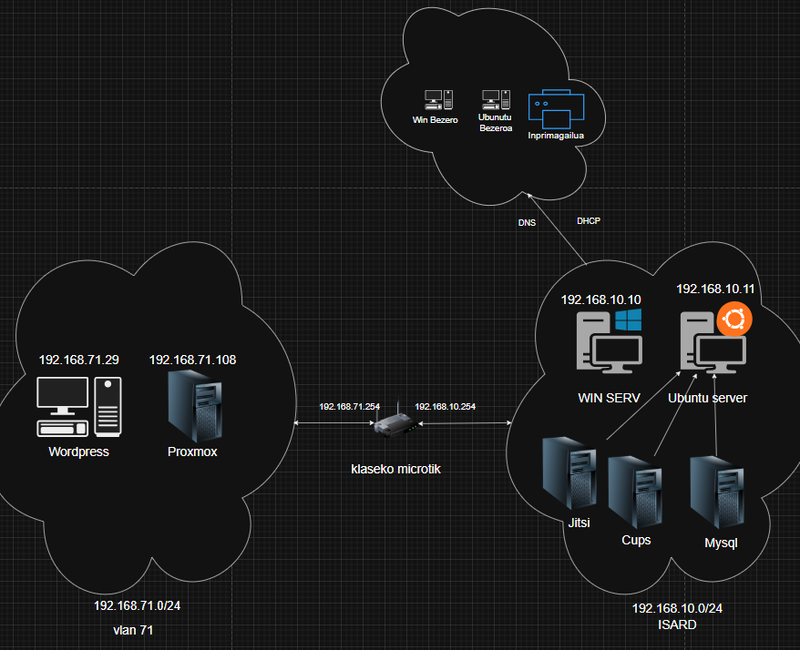

# Sare zerbitzuak

<figure><figcaption></figcaption></figure>

## 1. IP Helbideak

Zerbitzariaren ip-a --> **192.168.10.10**

Ubuntu server jitsi ip-a --> **192.168.10.11**

Proxmox ip-a --> **192.168.10.14**

Ubuntu server ip-a Cups--> **192.168.10.15**

Bulegoak1,2,3 ip-a --> **DHCP 192.168.10.100<-->200**

Kalitatea1,2,3 ip-a --> **DHCP 192.168.10.100<-->200**

Produkzioa1,2,3 ip-a --> **DHCP 192.168.10.100<-->200**

## **2. DNS Konfigurazioa:**

**DNS zerbitzaria** gure **Windows Server**-ean konfiguratu dugu, **192.168.10.10** IP helbidean.\
Horrela, gure sareko domeinuaren izenak **IP helbideetara bihurtzen dira automatikoki**, eta gainerako ordenagailuek zerbitzari hau erabiltzen dute izen-ebazpenerako.

### **DNS 192.168.10.10**

### **Zuzena**

Domeinu-izen bat IP helbide bihurtzen du. Hau erabiltzen da webgune edo zerbitzu baten helbidea aurkitzeko.

.png>)

### **Alderantzizkoa**

IP helbide bat domeinu-izen bihurtzen du. Hau erabilgarria da IP baten jatorria edo izen logikoa identifikatzeko.

.png>)

## **3. DHCP**

DHCP zerbitzaria sareko gailuei **IP helbideak eta sareko beste parametroak** (maskara, gateway, DNS...) automatikoki esleitzen dizkien zerbitzaria da. Horrela, ordenagailu edo gailuek **ez dute eskuz konfiguratu behar** IP helbidea; sarean sartzean, DHCP zerbitzariak automatikoki bidaltzen die konexiorako beharrezko informazioa.

Izena: burdinola\_dhcp

Tartea: 192.168.10.100 - 192.168.10.200

Iraupena: 8h pasa ondoren bota eta berriro konektatzean beste berri bat emango zaio.

.png>)

.png>)

Erreserba:

<figure><figcaption></figcaption></figure>

## **4. Bideo-Zerbitzua | Ubuntu Server Jitsi-meet**

Bideo-zerbitzua **Ubuntu Server** batean instalatuta dago, **192.168.10.11** IP helbidean.\
Jitsi Meet plataformak **bideokonferentzia seguruak eta kolaboratiboak** egiteko aukera ematen du, nabigatzailearen bidez, konturik gabe eta denbora errealean.\
Sareko erabiltzaileek IP hori erabiliz sar daitezke bideotxat saioetara.

### Konfigurazioa

.png>)

### Jitsi Meet Martxan

.png>)

https://[www.jitsi.burdinola.eus](http://www.burdinolajitsi.eus)

\
\
\

\

\
\
\
